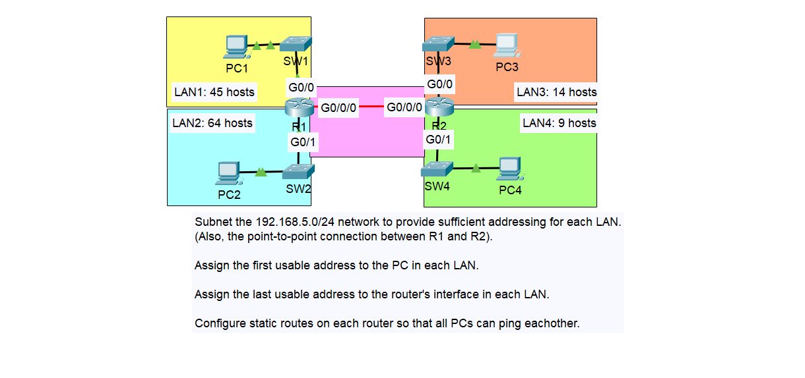

# Day 15 - VLSM (Variable Length Subnet Masking)

## Lab Summary  
In this lab, I subnetted the **192.168.5.0/24** network using VLSM to optimize IP allocation. Each LAN received a subnet based on its required hosts, including the point-to-point link between **R1** and **R2**.

### Steps performed:
1. **Subnetted** 192.168.5.0/24 for:  
   - **LAN1** (45 hosts)  
   - **LAN2** (64 hosts)  
   - **LAN3** (14 hosts)  
   - **LAN4** (9 hosts)  
   - **P2P link (R1 ↔ R2)**  
2. **Assigned IPs**:  
   - **First usable** IP to each PC.  
   - **Last usable** IP to each router interface.  
3. **Configured static routes** on R1 and R2 for full connectivity.  
4. **Verified connectivity** using `ping`.

## Network Topology

