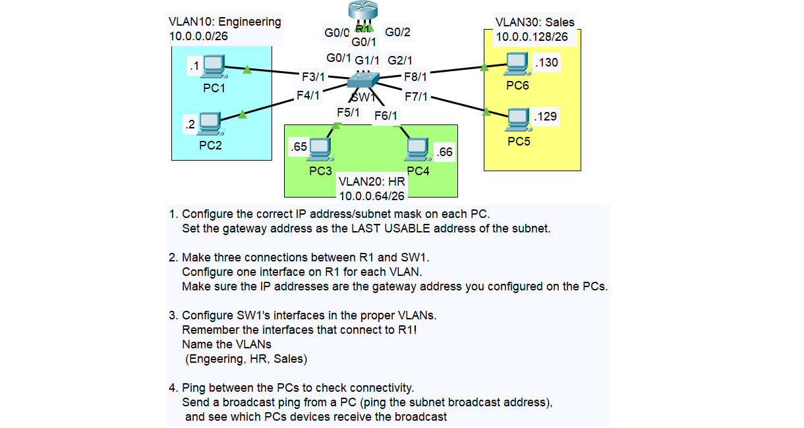

# Day 16 - VLANs and Inter-VLAN Routing

## Lab Summary  
In this lab, I configured three VLANs (**Engineering**, **HR**, and **Sales**) with proper subnetting and routing.

### Steps performed:
1. **Assigned IPs** to PCs:  
   - **10.0.0.0/26** (VLAN10 - Engineering): `.1`, `.2`  
   - **10.0.0.64/26** (VLAN20 - HR): `.65`, `.66`  
   - **10.0.0.128/26** (VLAN30 - Sales): `.129`, `.130`  
   - **Gateway**: last usable IP in each subnet  
2. **Configured R1** with one interface per VLAN (G0/0, G0/1, G0/2), using gateway IPs.  
3. **Set VLANs on SW1** and assigned access ports to the correct VLANs.  
4. **Verified connectivity** using `ping` and broadcast tests within each VLAN.

## Network Topology  

