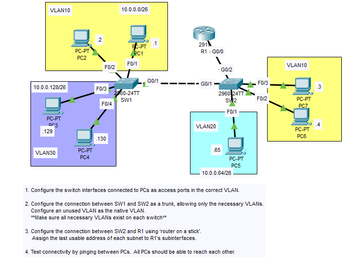

# Day 17 - VLANs & Router-on-a-Stick

## Lab Summary  
This lab focuses on VLANs distributed across two switches, trunking, and inter-VLAN routing using subinterfaces on the router.

### Steps performed:
1. **Verified pre-configured IPs** on PCs:  
   - **VLAN10** (10.0.0.0/26):  
     - PC1 `.1`, PC2 `.2` (SW1)  
     - PC6 `.4`, PC7 `.3` (SW2)  
   - **VLAN20** (10.0.0.64/26):  
     - PC5 `.65` (SW2)  
   - **VLAN30** (10.0.0.128/26):  
     - PC3 `.129`, PC4 `.130` (SW1)  
   - **Gateways** (Router subinterfaces):  
     - `.62` (VLAN10), `.126` (VLAN20), `.190` (VLAN30)

2. **Configured switchports**:  
   - Access ports assigned to correct VLANs  
   - Trunk link between SW1 and SW2 (`G0/1`) with VLANs 10 and 30 allowed  
   - Native VLAN set to an unused VLAN (1001) for security

3. **Router-on-a-Stick (R1)**:  
   - Trunk on `G0/0` interface connected to SW2 `G0/2`   
   - Subinterfaces created for VLANs 10, 20, and 30 with respective gateway IPs

4. **Verified connectivity**:  
   - Successful pings between all PCs across VLANs
## Network Topology  
