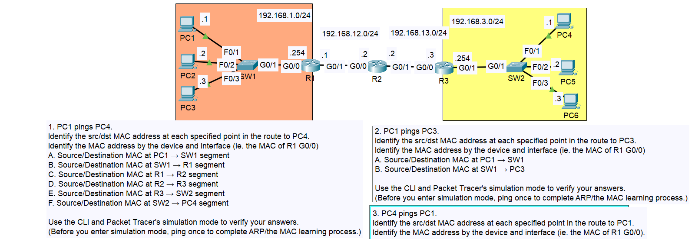
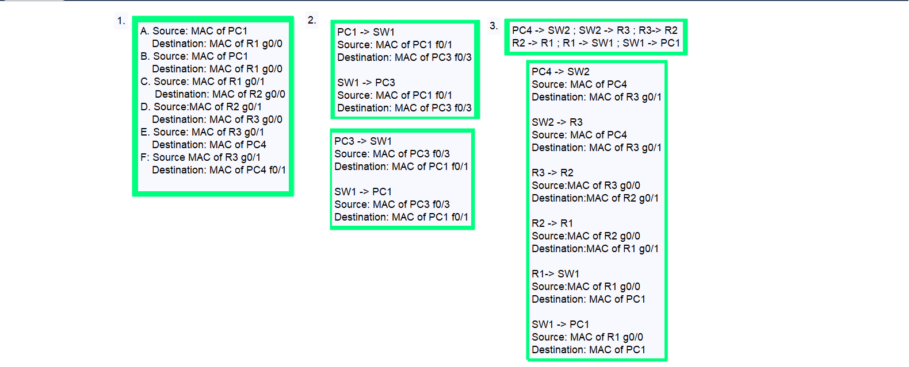

# Day 12 - Life of a Packet  

## Lab Summary  
In this lab, I analyzed how a packet moves through a network. The devices were already preconfigured, and my task was to observe the packet's journey and answer related questions.  

### Steps performed:  
1. **Examined packets** through the network.  
2. **Analyzed changes** in MAC address at each hop.  
3. **Answered questions** based on observations.  

## Lab Topology Questions and Answers  

  
