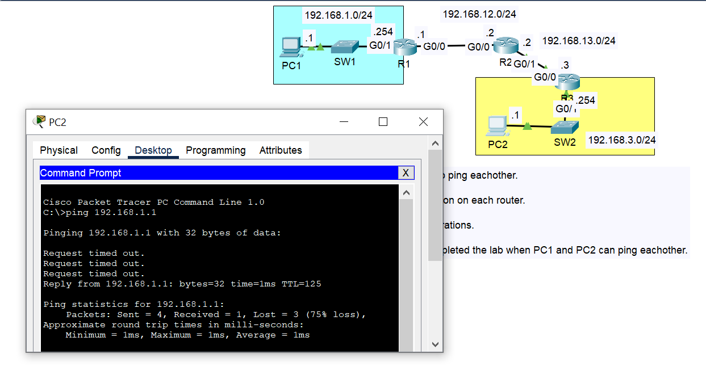

# Day 11 - Jeremy IT Labs

## Lab Summary  
In this lab, I configured the network to allow communication between PC1 (192.168.1.1) and PC2 (192.168.3.1) through three routers (R1, R2, and R3).

### Steps performed:
1. **Configured IP addresses** on:  
   - PC1 and PC2, including their default gateways.  
   - Router interfaces (R1, R2, and R3).  
2. **Configured static routes** on all three routers to ensure proper packet forwarding.  
3. **Verified connectivity** between PC1 and PC2 using `ping`.  
   - The first 3-5 pings may fail due to ARP resolution.  

## Network Topology

